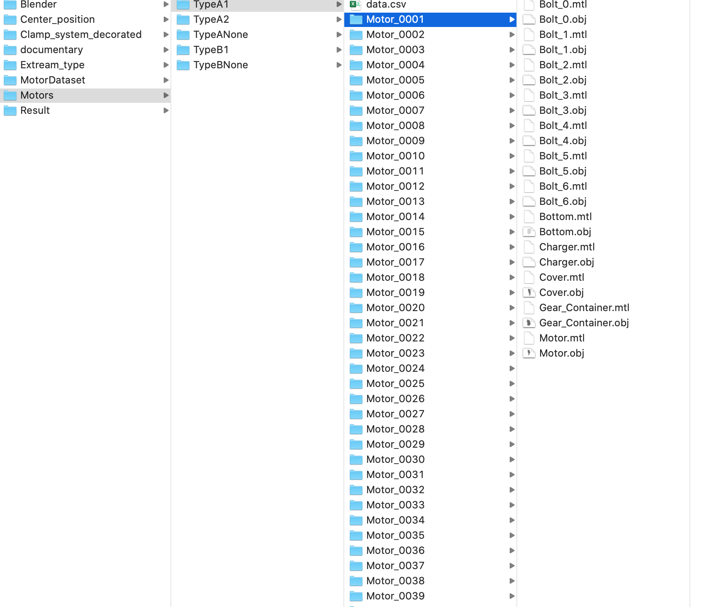

# dataset_generate
generate synthetic dataset using blender and blensor

These python programs are used for generating and preprocessing the 3D point cloud from Bosch motors. the main steps are divided into two parts. 

1.we use [Blender2.9](https://www.blender.org/download/releases/2-90/) with help of [Motor Factory](https://github.com/cold-soda-jay/blenderMotorFactory) to generate motor mesh motors with different size in different parts. In our case, we wiil firstly generate 1000 motors by copying script in synthetic_motors_generate.py into blender and running it in blender. In this script, we should set BASE_DIR as the root where we save the generated mesh  motors and at same time, the clamping system should put under this directory.

2.After we got different models of motors, we merge them with clamping_system to form a wholistic secne. For each secne, we have different motor components size and different layout of clamping system. In this way we cloud form a valid variance in order to improve training performance.we use [Blensor](https://www.blensor.org/pages/downloads.html)(in my project,i use the blensor for Macos ) to scan a point cloud from a chosen view set randomly.

# Preparing

1. For the usage of blender and how to add a addon into blender, there are maney tutorial in the internet. I reconmand one provided [you can find in installation part](https://github.com/cold-soda-jay/blenderMotorFactory). As how to use blensor on macos[here is a tutorial](https://www.youtube.com/watch?v=25yvAUhFIoI&t=81s).

2. Because there is compatable problem for Blensor and Blender, I use Bender2.9 to generate motor mesh models. after attaining the mesh models, we import mesh models and clamping system models within Blensor, and then we scan a point cloud for each secen using buildin function tof.advanced_scan()  

# Get Started
As i have put above, the main steps include two parts,

1. Generate many(I generate 1250 motors mesh in order to generate enough trainging dataset) motors mesh. As for how to generate the motors mesh, First, you have to successfully install addon Motor Factory on Blender. Then try to run synthetic_motor_generate.py in blender. In order to run this code, you shoud copy the script into blender2.9 and set the BASE_DIR with a path, in which you want to save all you motor mesh models.   If you operate successfully,you will get a directory structure like below 

2. the next step is to merge motors and clamping system and get a point cloud. All this part should be done in Blensor. For this part, you could use assemble_cut_dataset.py script  in belnsor to generate only one secne and generates its corresponding point cloud. In this part. There are three path you should set up.
                          
* file_path = "/Users/bixuelei/Master/Center_position/TypeA1"

        this path is where you put single motor mesh model (you can generate specific motor using programming provided in create_motor)

* Clamping_dir = "/Users/bixuelei/Master/Clamp_system_decorated"

        this is where  you put the claming system

* save_path = "/Users/bixuelei/Master/Result/Training/" +...

        this is where you save your generated numpy file. With this part of code, you could check what kind of secen you will generate.
        If you run those code in windows OS, you should change the path with"'\\"

# Generate a whole dataset
If the secne is what you want, you could using the parameters in the assemble_cut_dataset.py and apply them in the generate_dataset.py.For generate.dataset.py,you should set the number of secen you want to generate(the parameter is 'num_training_models'). For the path setup, it is similar with the setting above.

    * file_base = "/Users/bixuelei/Master/Motors"

        here,the file_base is where all you motors save generate by steps 1

    * Clamping_dir = "/Users/bixuelei/Master/Clamp_system_decorated"

        this is where you save you claming system

    * save_path = "/Users/bixuelei/Master/Result/Training/"

        this is where you save your generated numpy file.
    
    * num_training_models=125

        this is number of secen i currently want to generate
